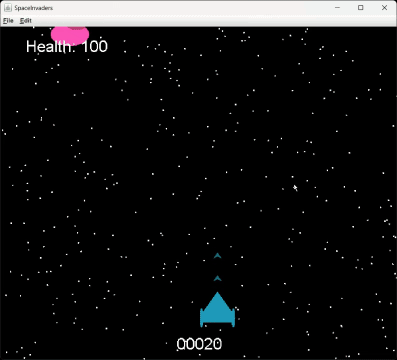

## Space Invaders Game



This game is a modified version of the classic Atari Space Invaders. In this version, the aliens move toward you rather than staying stationary. The objective is to earn as many points as possible by eliminating aliens without losing all of your health. Your health will gradually regenerate over time.

Instructions for gameplay will also be displayed upon running the program.

You can choose a difficulty level from 1 to 5 (1 being the easiest, 5 being the hardest).
The score counter is displayed at the bottom center of the screen, and your health is shown at the top left.
Your highest score is saved, and you can continue playing after reaching a new high score.

Good luck!

## Gradle Build Instructions

This project uses Gradle to manage dependencies and build tasks.

### Prerequisites

Before running the game, ensure you have the following installed:
- [Java Development Kit (JDK) 8 or higher](https://www.oracle.com/java/technologies/javase-downloads.html)
- [Gradle](https://gradle.org/install/)

### Run the Game

To build and run the game, open a terminal or command prompt and navigate to the root directory of the project. Then, use the following Gradle commands:

1. Build the project:
```bash
gradle build
```

2. Run the game:

```bash
gradle run
```

The game should now launch, and you can start playing.

### Clean the project

```bash
gradle clean
```

This will remove any generated files, allowing you to start fresh with a new build.